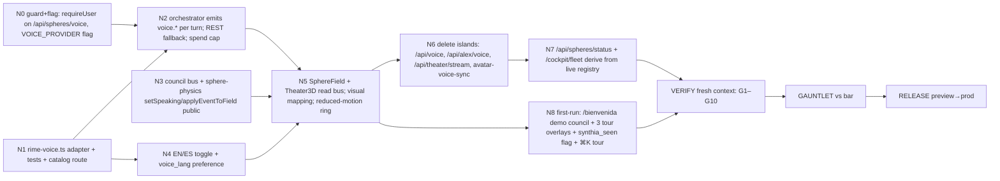

# Task graph — RUN-001

| id | job | reads | writes | owns | depends_on | parallel_group | risk | human_gate | status |
|---|---|---|---|---|---|---|---|---|---|
| N-1 | LLM policy: free models by default (OpenRouter FREE_CHAIN), paid only via switcher; /api/models; ModelSwitcher in /chat; /api/stream re-based on OpenRouter + requireUser; synthia/agent + spheres/chat accept `model` | models.ts, litellm-gateway.ts | src/lib/models.ts, litellm-gateway.ts, api/models, api/stream, components/ModelSwitcher.tsx, chat/page.tsx, api/synthia/agent, api/spheres/chat | those files | — | — | low | no | built (unverified) |
| N0 | guard voice route, add feature flags | guards.ts | api/spheres/voice/route.ts, env docs | route file | — | P1 | low | no | pending |
| N1 | Rime adapter (REST+WS+timing), unit tests, `/api/spheres/voice/catalog` | reference-impl/rime-voice.ts, registry/spheres.md | src/lib/voice/rime-voice.ts, mercury-voice.ts (chain), catalog route | src/lib/voice/* | — | P1 | low | no | pending |
| N2 | orchestrator: per turn synth → emit voice.chunk/words/done; cap; fallback | N1 | api/council/orchestrator/route.ts, council-engine hooks | orchestrator | N0,N1 | — | med | no | pending |
| N3 | council bus + physics exports | reference-impl/council-bus.ts, sphere-physics.ts | src/lib/council/bus.ts, sphere-physics.ts | bus, physics | — | P1 | med | no | pending |
| N4 | language toggle + preference | N1 map | header component, /api/synthia/memory PATCH, personalization page | toggle | N1 | P1 | low | no | pending |
| N5 | renderers consume bus; shader mapping; reduced-motion 2D ring; HUD words | design/council-bus-and-graphics.md | SphereField.tsx, Theater3D.tsx, new SphereRing2D | renderers | N2,N3,N4 | — | med | no | pending |
| N6 | delete islands + update callers/docs | registry/routes.md | 4 files removed | — | N5 | — | low | **yes (owner)** | pending |
| N7 | status + fleet from live meeting registry | N2 | api/spheres/status, cockpit/fleet | those files | N6 | — | low | no | pending |
| N8 | first-run journey: /bienvenida, welcome council (3 spheres, $0.30 cap), tour overlays, SphereRing2D mobile | design/observatorio-and-first-run.md | app/bienvenida/*, components/tour/*, middleware flag | those files | N5 | — | med | no | pending |
Parallel group P1 = {N0, N1, N3, N4} (disjoint writers). Irreversible edge: N6 deletions (owner gate); release (owner gate).
